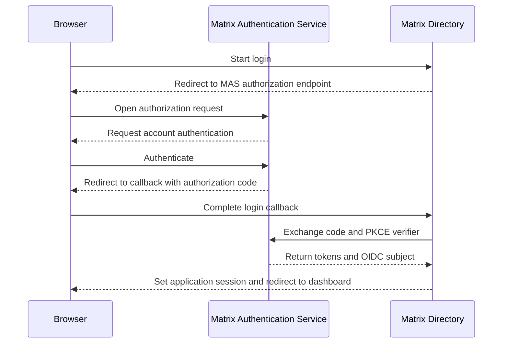
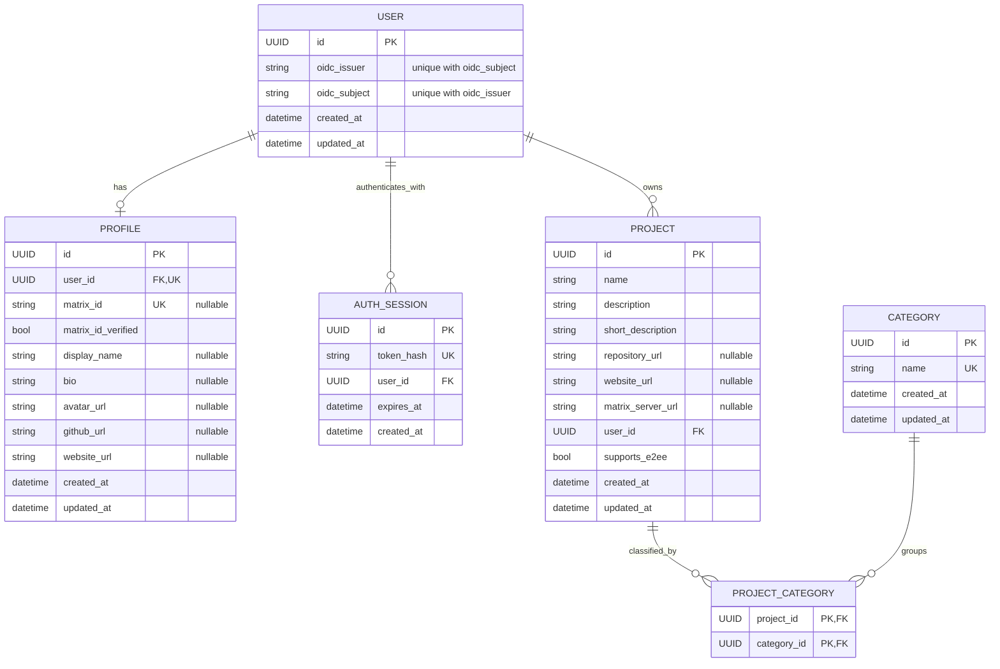

# Authentication architecture

Matrix Directory authenticates users through the
[Matrix Authentication Service (MAS)](https://element-hq.github.io/matrix-authentication-service/)
using OpenID Connect (OIDC). It then creates its own application session for
profile and project-management requests.

## At a glance

| Matrix Directory does | Matrix Directory does not |
| --- | --- |
| Authenticate an account through MAS | Receive or store a Matrix password |
| Use the OIDC issuer and subject as a private identity | Treat an OIDC subject as a Matrix ID |
| Create a separate application session | Reuse Matrix access tokens as application sessions |
| Authorize profile and project changes | Read rooms, messages, or other Matrix account data |

!!! important
    Authentication proves which application user is making a request.
    Authorization still happens in the backend for every protected operation.

## Trust boundaries

The browser, MAS, and Matrix Directory have separate responsibilities:



MAS authenticates the Matrix account. Matrix Directory validates the OIDC
response, resolves a local user, and owns the resulting application session.

## Identity model

MAS provides an OIDC `sub` claim. It is an opaque account identifier, not a
Matrix ID. A local user is uniquely resolved by the pair:

```text
(oidc_issuer, oidc_subject)
```

Using both values prevents subjects from different issuers from being treated
as the same account.

### Private identity and public profile

| Data | Visibility | Purpose |
| --- | --- | --- |
| User ID | Public where ownership must be represented | Stable application identifier |
| OIDC issuer and subject | Private | Authentication and account lookup |
| Profile | Public | Community-facing identity |
| Matrix ID | Public but user-provided | Optional profile address |
| Matrix ID verification | Public but server-controlled | Future proof of control |

A profile's `matrix_id` is not automatically trusted. Changing it clears
`matrix_id_verified`, and API clients cannot set the verification flag.

## Persistence model

This entity-relationship diagram shows database cardinality. A user may exist
without a profile, and may own multiple projects and application sessions.



!!! note "Category invariant"
    The database relationship permits a project to have zero or more category
    rows. The API and project service enforce the stronger domain rule that a
    project must be created and updated with at least one category.

## Login flow

1. The browser requests `GET /api/auth/matrix/login`.
2. The backend redirects to MAS using the authorization-code flow with PKCE.
3. MAS authenticates the account and redirects to
   `GET /api/auth/matrix/callback`.
4. The backend exchanges the authorization response and reads the OIDC subject.
5. It resolves or creates the local user by `(issuer, subject)`.
6. It creates an opaque Matrix Directory session and stores only its hash.
7. The browser receives the application-session cookie and is redirected to
   the dashboard.

The application currently requests only the `openid` scope. It does not
request Matrix Client API scopes.

If login fails, the callback redirects to the frontend login page with a
user-facing error. If OIDC is not configured, the login endpoint returns
`503 Service Unavailable`.

## Session lifecycle

Authentication uses two cookies with different jobs:

| Cookie | Purpose | Lifetime |
| --- | --- | --- |
| `matrix_oidc_flow` | Preserve temporary state during the OIDC redirect flow | 10 minutes |
| `matrix_directory_session` | Authenticate Matrix Directory API requests | 7 days |

The application-session cookie is HTTP-only, uses `SameSite=Lax`, and is
scoped to `/`. Its `Secure` attribute is controlled by
`SESSION_COOKIE_SECURE` and must be enabled when the application is served
over HTTPS.

Only a SHA-256 hash of the opaque application-session token is stored in the
database. Protected endpoints reject missing, unknown, and expired tokens with
`401 Unauthorized`.

`POST /api/auth/logout` deletes the stored session when present and clears the
browser cookie. Calling logout without a current session is still successful.

## Authorization

The authentication dependency resolves the current `User` before a protected
route runs. Project ownership is then derived from that user:

```text
Application session
        |
        v
Authenticated User
        |
        v
Project.user_id
```

Clients cannot choose an arbitrary project `user_id`. Updates and deletions
are scoped by both project ID and authenticated user ID. A project that is
missing or belongs to another user produces the same `404 Not Found`
response.

Profile updates are similarly scoped to the current user.

## Security invariants

The following properties must remain true as authentication evolves:

- Matrix passwords are never handled by Matrix Directory.
- An OIDC subject is never interpreted as a Matrix ID.
- Users are identified by the `(issuer, subject)` pair.
- OIDC identity fields are never returned by public API schemas.
- Raw application-session tokens are never stored in the database.
- Project ownership always comes from the authenticated session.
- Authorization checks always run on the backend.
- Clients cannot set `matrix_id_verified`.
- Matrix Client API access is requested only for a feature that explicitly needs it.

## Local development

Testing a real redirect flow locally requires a public HTTPS callback. The
[development guide](../development.md#test-matrix-login-locally) explains how
to register a temporary OAuth client and run the Cloudflare tunnel helper.

## References

- [Matrix Authentication Service](https://element-hq.github.io/matrix-authentication-service/)
- [MAS authorization documentation](https://element-hq.github.io/matrix-authentication-service/topics/authorization.html)
- [MAS OAuth scopes](https://element-hq.github.io/matrix-authentication-service/reference/scopes.html)
- [MAS API reference](https://element-hq.github.io/matrix-authentication-service/api/index.html)
- [HTTP API reference](../reference/api.md)
