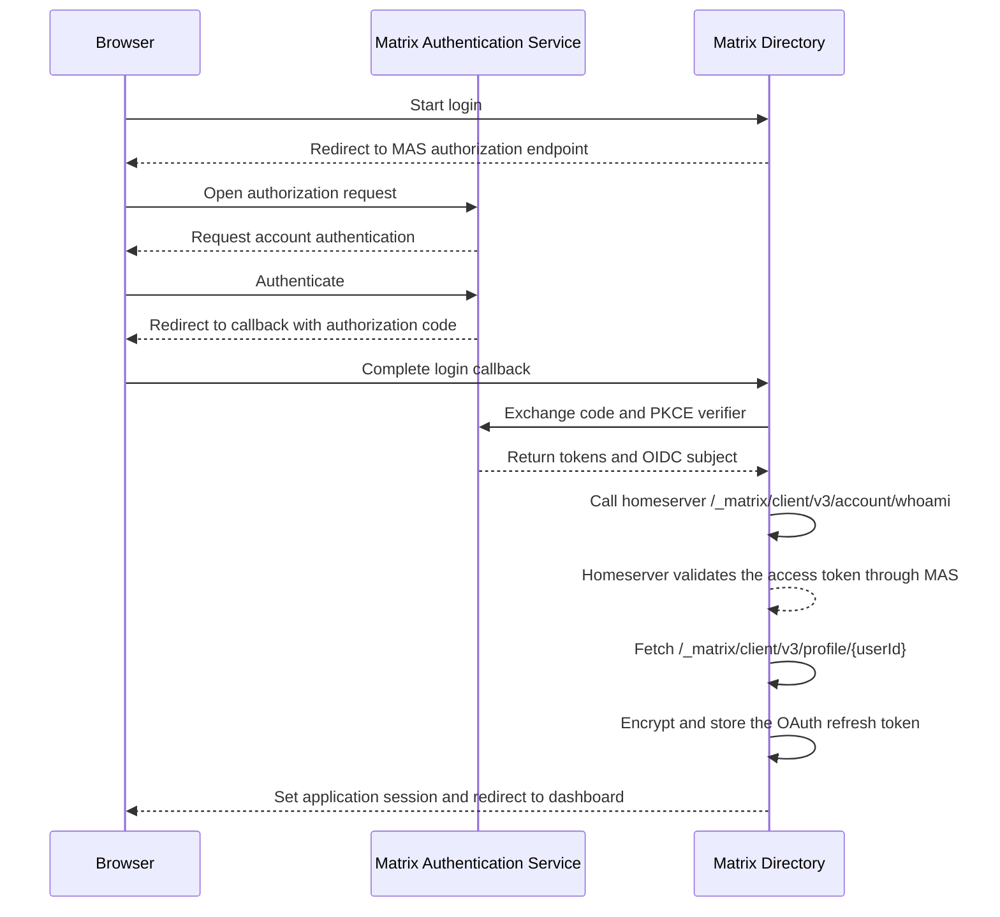
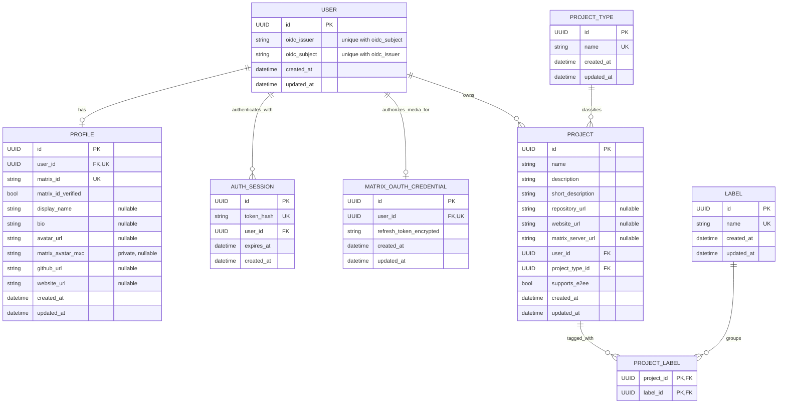

# Authentication architecture

Matrix Directory authenticates users through the
[Matrix Authentication Service (MAS)](https://element-hq.github.io/matrix-authentication-service/)
using OpenID Connect (OIDC). It then creates its own application session for
profile and project-management requests.

## At a glance

| Matrix Directory does | Matrix Directory does not |
| --- | --- |
| Authenticate an account through MAS | Receive or store a Matrix password |
| Use the OIDC issuer and subject as a private identity | Treat an OIDC subject as a Matrix ID |
| Create a separate application session | Reuse Matrix access tokens as application sessions |
| Authorize profile and project changes | Read rooms, messages, or other Matrix account data |

!!! important
    Authentication proves which application user is making a request.
    Authorization still happens in the backend for every protected operation.

## Trust boundaries

The browser, MAS, and Matrix Directory have separate responsibilities:



MAS authenticates the Matrix account. Matrix Directory validates the OIDC
response, resolves a local user, and owns the resulting application session.

## Identity model

MAS provides an OIDC `sub` claim. It is an opaque account identifier, not a
Matrix ID. A local user is uniquely resolved by the pair:

```text
(oidc_issuer, oidc_subject)
```

Using both values prevents subjects from different issuers from being treated
as the same account.

### Private identity and public profile

| Data | Visibility | Purpose |
| --- | --- | --- |
| User ID | Public where ownership must be represented | Stable application identifier |
| OIDC issuer and subject | Private | Authentication and account lookup |
| Profile | Public | Community-facing identity |
| Matrix ID | Resolved from the homeserver | Authoritative Matrix account address |
| Matrix ID verification | Server-controlled | Confirms the `whoami` result for the login token |
| Matrix avatar `mxc://` URI | Private | Source for the authenticated avatar proxy |
| Encrypted Matrix refresh token | Private | Obtains a short-lived token for the avatar proxy |
| Custom avatar URL | Public | An image the user chose, which overrides the Matrix avatar |

A profile's Matrix ID is populated from the homeserver `whoami` response during
login. API clients cannot set the verification flag.

## Persistence model

This entity-relationship diagram shows database cardinality. A user may exist
without a profile, and may own multiple projects and application sessions. A
user may also have one encrypted Matrix OAuth credential for media proxying.



!!! note "Project classification"
    Every project has exactly one required project type and may have zero or
    more labels. Types describe what a project is; labels describe what it does.

## Login flow

1. The browser requests `GET /api/auth/matrix/login`.
2. The backend redirects to MAS using the authorization-code flow with PKCE.
3. MAS authenticates the account and redirects to
   `GET /api/auth/matrix/callback`.
4. The backend exchanges the authorization response and reads the OIDC subject
   and access token.
5. It calls the homeserver's `/_matrix/client/v3/account/whoami` endpoint with
   the access token and uses the returned Matrix ID as authoritative.
6. It fetches `/_matrix/client/v3/profile/{userId}` using that verified Matrix
   ID. Available display-name values seed missing local fields. A Matrix
   `mxc://` avatar URI is stored privately. A homeserver that disables profile
   lookup does not prevent login.
7. It resolves or creates the local user by `(issuer, subject)` and records the
   verified Matrix ID on the profile. It encrypts and stores the OAuth refresh
   token so the avatar can be fetched after the short-lived access token expires.
   A deployment whose OAuth client cannot issue a refresh token still signs the
   user in; only the avatar proxy is unavailable.
8. It creates an opaque Matrix Directory session and stores only its hash.
9. The browser receives the application-session cookie and is redirected to
   the dashboard.

The default OIDC scope is `openid urn:matrix:client:api:*`. Configure
`MATRIX_OIDC_SCOPE` when the deployment needs an additional device scope. The
backend uses the short-lived access token only for the immediate `whoami` call;
it does not store that token or use the OIDC `id_token` for Matrix API access.

## Avatar thumbnails

The browser never receives a Matrix OAuth token. When it requests
`GET /api/profiles/{userId}/avatar`, the backend decrypts the profile owner's
refresh token, obtains a short-lived access token from MAS, and streams the
authenticated Matrix `/_matrix/client/v1/media/thumbnail/...` response. The
response is publicly cacheable for one hour. This keeps the original `mxc://`
URI and all credentials out of public API responses while avoiding image
downloads or application-managed object storage.

The proxy URL is never written to the database. `avatar_url` stores only an
image the user chose; the Matrix avatar is resolved on read, so a stored value
never has to be parsed to recover what it means.

### Serving another server's bytes safely

The proxied body is chosen by a Matrix account and is served from this
application's own origin, so the response is constrained on several axes:

| Control | Value |
| --- | --- |
| Allowed media types | `image/png`, `image/jpeg`, `image/webp`, `image/gif` |
| Redirects | Not followed |
| Maximum body | 2 MiB |
| Response headers | `X-Content-Type-Options: nosniff`, a `sandbox` CSP |

`image/svg+xml` is rejected because SVG can execute script; a same-origin SVG
avatar would be a stored cross-site scripting vector. Redirects are refused so
that a homeserver cannot direct the backend at a host nobody validated.

### Refresh token rotation

MAS refresh tokens are single use. The backend caches the short-lived access
token in memory and locks the credential row while redeeming a refresh token,
so concurrent avatar requests cannot present the same token twice and trigger
replay detection.

### Credential lifetime

The stored credential outlives a browser session on purpose: an anonymous
visitor must still be able to load a maintainer's avatar. `DELETE
/api/profile/me/matrix-avatar` is the user-facing revocation path. It clears
the stored `mxc://` URI and deletes the encrypted refresh token, after which
the application holds no Matrix credential for that account. Signing in again
restores it.

`MATRIX_TOKEN_ENCRYPTION_KEY` is a required Fernet key for Matrix login. Set a
stable production secret, for example with:

```bash
python -c "from cryptography.fernet import Fernet; print(Fernet.generate_key().decode())"
```

Changing that key makes existing encrypted refresh tokens unreadable, so users
will need to sign in again unless a deliberate key-rotation process is added.

The MAS OAuth client must permit both `authorization_code` and `refresh_token`
grants. The local development helper registers both; production client metadata
must do the same.

If login fails, the callback redirects to the frontend login page with a
user-facing error. If OIDC is not configured, the login endpoint returns
`503 Service Unavailable`.

## Session lifecycle

Authentication uses two cookies with different jobs:

| Cookie | Purpose | Lifetime |
| --- | --- | --- |
| `matrix_oidc_flow` | Preserve temporary state during the OIDC redirect flow | 10 minutes |
| `matrix_directory_session` | Authenticate Matrix Directory API requests | 7 days |

The application-session cookie is HTTP-only, uses `SameSite=Lax`, and is
scoped to `/`. Its `Secure` attribute is controlled by
`SESSION_COOKIE_SECURE` and must be enabled when the application is served
over HTTPS.

Only a SHA-256 hash of the opaque application-session token is stored in the
database. Protected endpoints reject missing, unknown, and expired tokens with
`401 Unauthorized`.

`POST /api/auth/logout` deletes the stored session when present and clears the
browser cookie. Calling logout without a current session is still successful.

## Authorization

The authentication dependency resolves the current `User` before a protected
route runs. Project ownership is then derived from that user:

```text
Application session
        |
        v
Authenticated User
        |
        v
Project.user_id
```

Clients cannot choose an arbitrary project `user_id`. Updates and deletions
are scoped by both project ID and authenticated user ID. A project that is
missing or belongs to another user produces the same `404 Not Found`
response.

Profile updates are similarly scoped to the current user.

## Security invariants

The following properties must remain true as authentication evolves:

- Matrix passwords are never handled by Matrix Directory.
- An OIDC subject is never interpreted as a Matrix ID.
- Users are identified by the `(issuer, subject)` pair.
- OIDC identity fields are never returned by public API schemas.
- Raw application-session tokens are never stored in the database.
- Matrix OAuth access tokens are never stored or returned to the browser.
- Matrix refresh tokens are encrypted at rest and never returned by an API.
- Matrix-derived avatar URLs point to the local avatar proxy, not Matrix media.
- Proxied media is limited to non-scriptable image types and served with `nosniff`.
- The avatar proxy never follows a redirect away from the configured homeserver.
- A user can delete the stored Matrix credential without deleting their account.
- Avatar support never becomes a precondition for signing in.
- Project ownership always comes from the authenticated session.
- Authorization checks always run on the backend.
- Clients cannot set `matrix_id` or `matrix_id_verified`.
- Matrix Client API access is requested only for a feature that explicitly needs it.

## Local development

Testing a real redirect flow locally requires a public HTTPS callback. The
[development guide](../development.md#test-matrix-login-locally) explains how
to register a temporary OAuth client and run the Cloudflare tunnel helper.

## References

- [Matrix Authentication Service](https://element-hq.github.io/matrix-authentication-service/)
- [MAS authorization documentation](https://element-hq.github.io/matrix-authentication-service/topics/authorization.html)
- [MAS OAuth scopes](https://element-hq.github.io/matrix-authentication-service/reference/scopes.html)
- [MAS API reference](https://element-hq.github.io/matrix-authentication-service/api/index.html)
- [HTTP API reference](../reference/api.md)
